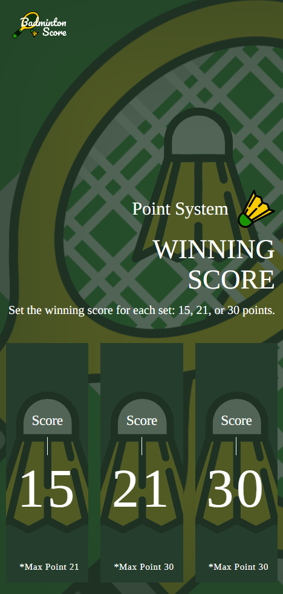
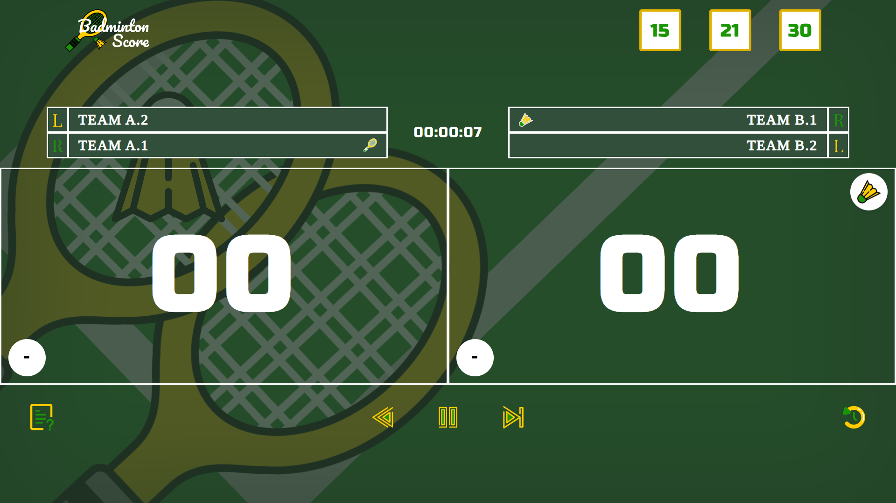

# 🏸 Badminton Scoreboard


🏸 A modern badminton scoreboard website for singles & doubles, built with **Next.js/Tailwind CSS** and deployed on **Vercel**. Accurately implements BWF serving/receiving rules, tracks score, sets, and match time. Features include live stats, point-by-point history, undo, and a detailed match summary modal.

🔗 **Live Demo** → [badmintonscore-web.vercel.app](https://badmintonscore-web.vercel.app/)

---
## 📸 Preview
| Desktop View | Mobile View |
|--------------|-------------|
|  |  |
|  |  |
---
## ✨ Features
- 🏸 **Accurate BWF Rules:** Automatically calculates and displays the correct server and receiver for doubles based on score, and the place server and receiver in the player name.
- 🧑‍🤝‍🧑 **Match Modes:** Fully supports both **Singles** and **Doubles** matches.
- 📊 **Detailed Match Stats:** A tabbed modal shows:
    -   **Overall Match Stats:** Total points, game points, most consecutive points.
    -   **Per-Game Stats:** A detailed breakdown for each game.
    -   **Live Point Flow:** A "worm" graph visualizing the point-by-point flow of each game, even while in progress.
- 🎮 **Full Match Controls:**
    -   **Undo:** Revert the last point scored.
    -   **Pause/Resume:** Pause and resume the match timer.
    -   **History:** View live stats at any time.
- 🧠 **Clean State Management:** Uses **React `useReducer`** to manage all complex match logic in a clean, predictable way (`matchReducer.ts`).

---

## 🚀 Getting Started Badminton Scoreboard in Local

### 1. Clone Repository
```bash
git clone https://github.com/BoviliusMeidi/badmintonscore-web.git
cd badmintonscore-web
```
### 2. Install Dependencies
```bash
npm install
# or
yarn install
```
### 3. Run Development Server
```bash
npm run dev
# or
yarn dev
```
### 4. Open in Browser
```bash
http://localhost:3000
```

---
## 📜 License & Acknowledgements

This project was built for portfolio and educational purposes and is licensed under the **MIT License**.
Feel free to fork, modify, and use the code. Attribution is appreciated! 🙌

-   All icons and assets used in this project were custom-designed.

---
## 👨‍💻 Author
Built by Me ➡️ [Bovilius Meidi](https://github.com/BoviliusMeidi) 😎
